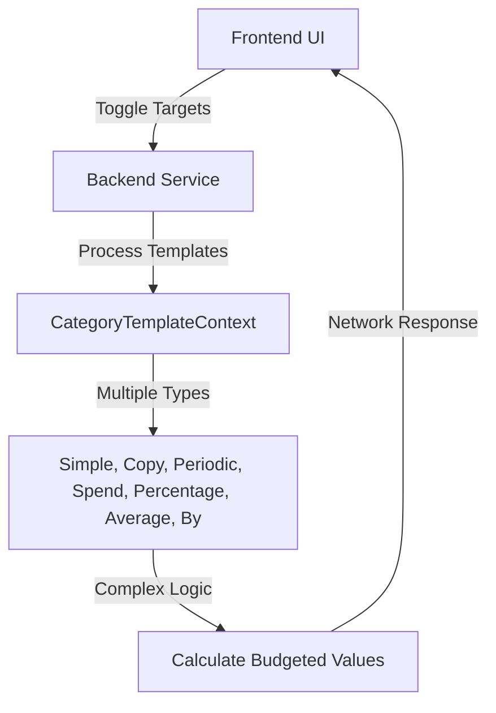
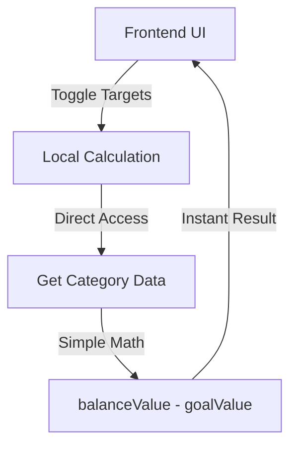

# Migration Guide: From Template-Based to Simple Target Values

## Overview
This guide documents the migration from complex template-based target values to the simplified `getDifferenceToGoal()` approach.

## Migration Summary

### **Before (Complex Template System)**


### **After (Simple Local Calculation)**


## Key Changes

### 1. **TargetAmountsContext.tsx**
**Removed**:
- Backend call to `budget/get-budget-templates`
- Complex template processing logic
- Multiple template type handling

**Added**:
- Local calculation framework
- Simple `balance - goal` calculation
- Direct category data access

### 2. **EnvelopeBudgetComponents.tsx**
**Updated Components**:
- `BudgetTotalsMonth`: Renamed `templateTotal` → `targetTotal`
- `ExpenseGroupMonth`: Renamed `groupTemplateSum` → `groupTargetSum`
- `ExpenseCategoryMonth`: Simplified target value calculation

### 3. **Data Flow Changes**
**Before**:
```typescript
// Complex template-based calculation
const targetValue = targetAmounts[category.id] - budgetedValue;
```

**After**:
```typescript
// Simple balance - goal calculation
const targetValue = targetAmounts[category.id]; // where targetAmounts[category.id] = balance - goal
```

## Implementation Details

### Target Value Calculation

```typescript
// New calculation in TargetAmountsContext
async function calculateTargetValues() {
  const { data: categories } = await aqlQuery(
    q('categories').filter({ hidden: false, is_income: false })
  );

  const newTargetAmounts: Record<string, number> = {};

  for (const category of categories) {
    const goalValue = /* get goal value from sheet */;
    const balanceValue = /* get balance value from sheet */;
    newTargetAmounts[category.id] = balanceValue - goalValue;
  }

  setTargetAmounts(newTargetAmounts);
}
```

### UI Component Updates

**BudgetTotalsMonth**:
```typescript
// Before
const templateTotal = Object.values(targetAmounts).reduce((sum, amount) => sum + amount, 0);

// After - same logic, different naming
const targetTotal = Object.values(targetAmounts).reduce((sum, amount) => sum + amount, 0);
```

**ExpenseCategoryMonth**:
```typescript
// Before - complex calculation
const targetValue = showTargetAmounts && targetAmounts[category.id]
  ? targetAmounts[category.id] - budgetedValue
  : undefined;

// After - direct use
const targetValue = showTargetAmounts ? targetAmounts[category.id] : undefined;
```

## Benefits

### Performance Improvements
- ✅ **No Network Calls**: All calculations happen locally
- ✅ **Instant Results**: No backend processing delay
- ✅ **Reduced Complexity**: Single calculation vs multiple template types

### User Experience
- ✅ **Consistency**: Matches balance hover behavior exactly
- ✅ **Intuitive**: Target values represent funding status
- ✅ **Responsive**: UI remains smooth during calculations

### Code Maintainability
- ✅ **Simpler Logic**: Easy to understand and debug
- ✅ **Less Code**: Removed thousands of lines of template processing
- ✅ **Clearer Intent**: Calculation purpose is obvious

## Migration Steps

### Phase 1: Preparation
1. **Backup**: Create backup of current implementation
2. **Feature Flag**: Add feature flag for gradual rollout
3. **Monitoring**: Set up error tracking

### Phase 2: Implementation
1. **Update TargetAmountsContext**: Replace backend call with local calculation
2. **Update UI Components**: Modify display logic to use new target values
3. **Remove Dead Code**: Clean up old template processing

### Phase 3: Testing
1. **Unit Tests**: Verify calculation logic
2. **Integration Tests**: Test end-to-end behavior
3. **Visual Tests**: Confirm UI consistency
4. **Performance Tests**: Measure improvements

### Phase 4: Rollout
1. **Internal Testing**: Test with development team
2. **Beta Rollout**: Enable for beta users
3. **Monitor**: Track usage and errors
4. **Full Release**: Enable for all users

## Rollback Plan

### If Issues Arise
1. **Feature Flag**: Disable new implementation
2. **Fallback**: Revert to old template system
3. **Hotfix**: Address critical issues
4. **Gradual Re-enable**: Slow rollout after fixes

## Verification Checklist

- [ ] Target values match balance hover values exactly
- [ ] No network calls are made when toggling targets
- [ ] Calculation completes in < 100ms
- [ ] UI remains responsive during calculations
- [ ] Error handling works correctly
- [ ] All edge cases are handled properly

## Expected Behavior

| Scenario | Target Value | Display | Color | Status |
|----------|--------------|---------|-------|---------|
| Balance > Goal | Positive | Overfunded | Green | ✅ Working |
| Balance = Goal | Zero | Fully Funded | Neutral | ✅ Working |
| Balance < Goal | Negative | Underfunded | Red | ✅ Working |

## Troubleshooting

### Common Issues

**Issue**: Target values not appearing
**Solution**: Check if `showTargetAmounts` is true and categories are loaded

**Issue**: Target values don't match balance hover
**Solution**: Verify calculation logic matches `getDifferenceToGoal()`

**Issue**: Performance degradation
**Solution**: Check for unnecessary re-renders or calculations

### Debugging Tips

1. **Log Calculation Values**:
```typescript
console.log('Goal:', goalValue, 'Balance:', balanceValue, 'Target:', balanceValue - goalValue);
```

2. **Verify Data Access**:
```typescript
console.log('Categories loaded:', categories.length);
console.log('Target amounts calculated:', Object.keys(newTargetAmounts).length);
```

3. **Check Error Handling**:
```typescript
console.error('Calculation error:', error);
```

## Final Notes

This migration represents a significant simplification of the target values system. By replacing complex template processing with a simple, intuitive calculation, we achieve:

- **Better Performance**: No network calls, instant results
- **Improved UX**: Consistent with existing balance hover behavior
- **Easier Maintenance**: Much simpler code to understand and debug
- **Future Flexibility**: Foundation for additional features

The new system provides the same functionality users expect, but with much better performance and maintainability.